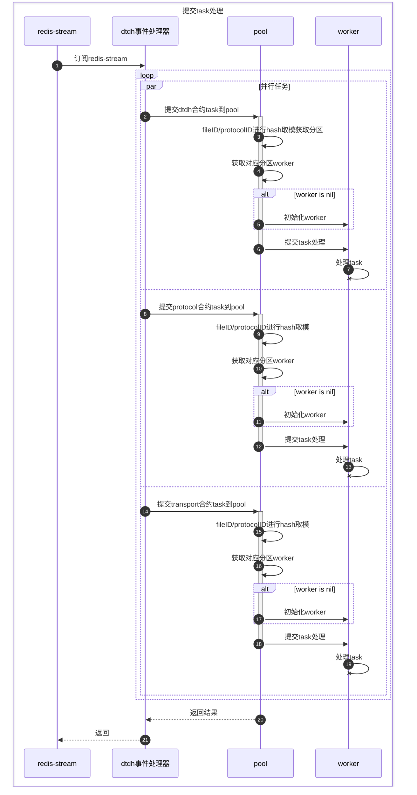

```mermaid
sequenceDiagram
    box 提交task处理
    participant redis-stream
    participant dtdhEvent as dtdh事件处理器
    participant pool
    participant worker
    end
autonumber

redis-stream ->> dtdhEvent: 订阅redis-stream
loop
    par 并行任务
        dtdhEvent ->>+ pool: 提交dtdh合约task到pool
        pool ->> pool: fileID/protocolID进行hash取模获取分区
        pool ->> pool: 获取对应分区worker
        alt worker is nil
            pool ->> worker: 初始化worker
        end
        pool ->>- worker: 提交task处理
        worker -x worker: 处理task
    and
        dtdhEvent ->>+ pool: 提交protocol合约task到pool
        pool ->> pool: fileID/protocolID进行hash取模
        pool ->> pool: 获取对应分区worker
        alt worker is nil
            pool ->> worker: 初始化worker
        end
        pool ->>- worker: 提交task处理
        worker -x worker: 处理task
    and
        dtdhEvent ->>+ pool: 提交transport合约task到pool
        pool ->> pool: fileID/protocolID进行hash取模
        pool ->> pool: 获取对应分区worker
        alt worker is nil
            pool ->> worker: 初始化worker
        end
        pool ->>- worker: 提交task处理
        worker -x worker: 处理task
    end
end
pool -->> dtdhEvent: 返回结果
dtdhEvent -->> redis-stream: 返回
```
